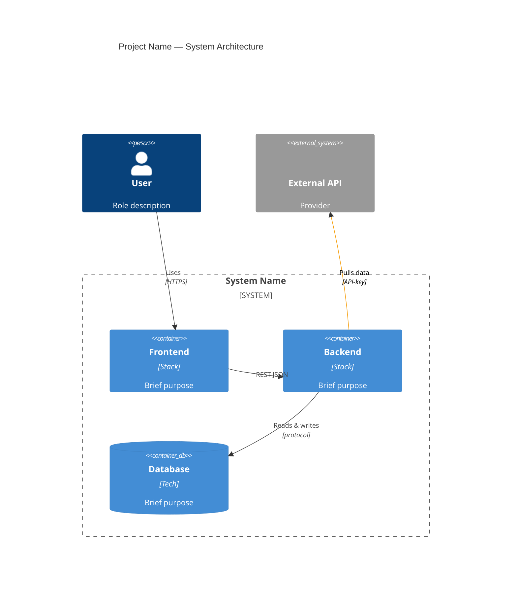
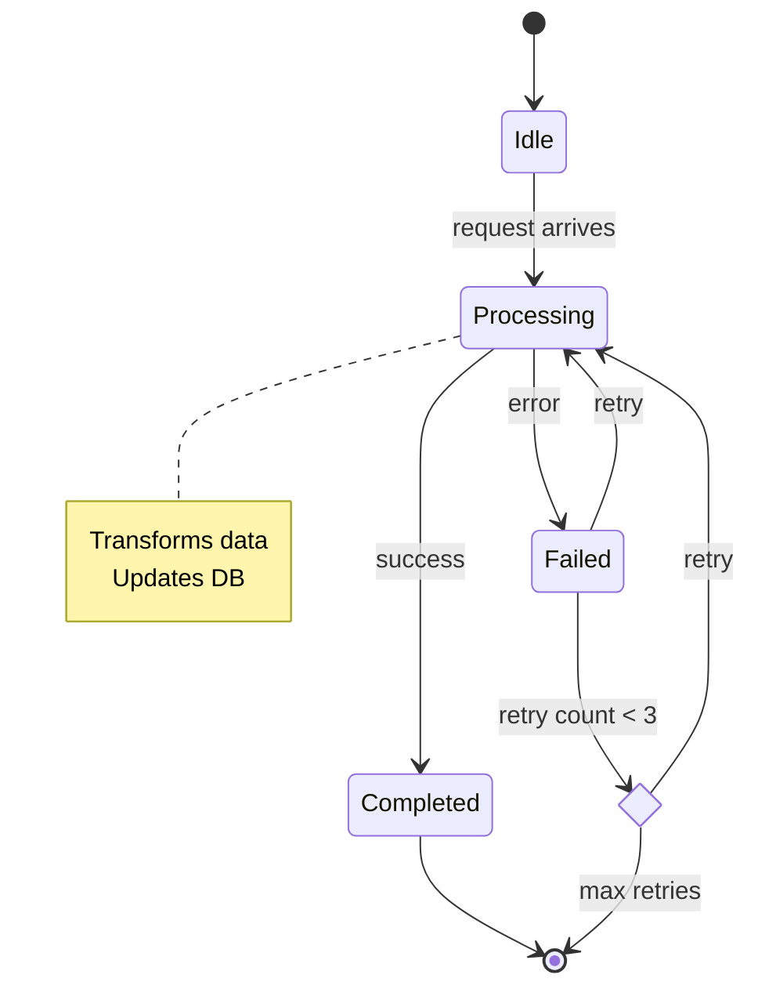

# Architecture Documentation Reference

## Size Targets

All diagrams must render within a 2560×1440 (2K) viewport without scrolling. Target sizes (viewBox dimensions from rendered SVGs):

| Diagram | Direction | Target (max) | Notes |
|---------|-----------|--------------|-------|
| C4 Container | Vertical (fixed) | ≤1000×1100 | C4 is inherently vertical; control via element count |
| Data Flow | `LR` | ≤2200×300 | Horizontal pipeline — wide is fine, keep height minimal |
| Backend Layers | `LR` | ≤2600×900 | Widest acceptable; horizontal scroll OK if needed |
| State Machine | Vertical (fixed) | ≤600×500 | Compact by nature — 5-7 states max |

**If any diagram exceeds its target**, reduce before continuing:
- C4: cut elements to 5, shorten all labels to 1-2 words
- Flowcharts: trim node text to 1 line, remove verbose edge labels
- Backend: collapse subgraphs, reduce nesting depth
- State: fewer states, shorter note text

## Choosing diagrams

See [SKILL.md](SKILL.md) Step 0 for the decision framework. This reference covers all supported diagram types — pick only the ones that make sense for the project.

## Diagram Patterns

### C4 Container Diagram (`architecture-c4-container.mmd`)

**When to include**: Multi-service systems, apps with external integrations, anything with >1 container or system boundary. Skip for monoliths with no external deps.

Purpose: High-level system architecture showing containers, external systems, and their relationships.

Rules:
- Max 5–6 elements total (1 Person + 3–4 containers in boundary + 1–2 System_Ext)
- Max 4 Rel() edges — keep labels 1–2 words
- Strip deployment infra (Firebase, Cloud Run, etc.) — show only core architecture
- Container descriptions: 1 line max
- Use `UpdateRelStyle` with `$textColor="#000"` for all edges, `$lineColor="#f59e0b"` for external connections
- Use `UpdateLayoutConfig($c4ShapeInRow="2", $c4BoundaryInRow="1")` for compact layout
- No empty description strings — use short meaningful text or omit desctiption params

Example:


### Data Flow Diagram (`sync-flow.mmd`)

**When to include**: Non-trivial pipelines — ingestion flows, event processing, multi-step request lifecycles, async job workflows. Skip for simple CRUD request/response paths.

Purpose: Core data pipeline, ingestion flow, or request lifecycle.

Rules:
- Use `flowchart LR` for widescreen (switch to TD if vertical makes more sense)
- Max 10–12 nodes
- Node labels: 1–2 lines max, use `<br/>` for line breaks
- Edge labels: 1 word whenever possible
- Use `%%{init: {'theme': 'default'}}%%` — no custom themeVariables
- Colored nodes via `classDef` + `class` (not inline `style`):
  ```mermaid
  classDef purple fill:#4f46e5,color:#fff,stroke:#3730a3
  classDef green  fill:#10b981,color:#fff,stroke:#059669
  classDef amber  fill:#f59e0b,color:#111,stroke:#d97706
  classDef violet fill:#8b5cf6,color:#fff,stroke:#7c3aed
  class StartNode purple
  class SuccessNode green
  class ExternalNode amber
  class AuditNode violet
  ```

### State Diagram (`estado-state-machine.mmd`)

**When to include**: Systems with a prominent, explicitly coded state machine driving core business logic — machine estado, order lifecycle, approval workflows, connection states. A good litmus test: is there an enum with a fixed set of states and explicit transition rules in the code? Skip for implicit state (e.g. status flags with no transition logic) or stateless CRUD.

Purpose: Visualize the finite state machine at the heart of the business logic.

Rules:
- Use `stateDiagram-v2` for Mermaid's state diagram syntax
- Max 5–7 states (including [*] start/end)
- Add `note` blocks for state descriptions (what happens in each state)
- Use `<<choice>>` for decision/guard pseudo-states (e.g. flap guards, validation gates)
- Colored states via `classDef` + `class`:
  ```mermaid
  classDef green  fill:#10b981,color:#fff,stroke:#059669
  classDef red    fill:#ef4444,color:#fff,stroke:#dc2626
  classDef amber  fill:#f59e0b,color:#111,stroke:#d97706
  class Running green
  class Stopped red
  ```

Example:


### Backend Layers Diagram (`backend-layers.mmd`)

**When to include**: Backends with distinct transport/logic/data/infra layers. Skip for thin backends, serverless functions, proxy-only services, or projects with no backend.

Purpose: Internal application structure — layers and their relationships.

Rules:
- Use `flowchart LR` for widescreen
- Nest subgraphs for each layer: Transport → Business Logic → Data → Infrastructure
- Use `direction TB` inside each layer subgraph for vertical stacking within the layer
- Colored nodes via `classDef` + `class`:
  ```mermaid
  classDef amber   fill:#f59e0b,color:#111,stroke:#d97706
  classDef green   fill:#10b981,color:#fff,stroke:#059669
  classDef blue    fill:#4f46e5,color:#fff,stroke:#3730a3
  classDef indigo  fill:#6366f1,color:#fff,stroke:#4f46e5
  ```

## SVG Rendering

Use the mermaid-studio skill's render script:

```bash
MERMAID_STUDIO="$HOME/.claude/skills/mermaid-studio"
node "$MERMAID_STUDIO/scripts/render.mjs" -i docs/diagrams/file.mmd -o docs/diagrams/file.svg
```

CRITICAL: Use `<object>` tags in HTML, NOT ``. Browsers block `foreignObject` rendering in ``-loaded SVGs, and Mermaid uses foreignObjects for all text labels.

```html
<object data="diagram.svg" type="image/svg+xml" style="max-width:100%;height:auto">Fallback text</object>
```

## HTML Presentation

Use [TEMPLATE.html](TEMPLATE.html) as the starting point. The template has boundary markers for each diagram section:

```
<!-- DIAGRAM:C4 start --> ... <!-- DIAGRAM:C4 end -->
<!-- DIAGRAM:FLOW start --> ... <!-- DIAGRAM:FLOW end -->
<!-- DIAGRAM:BACKEND start --> ... <!-- DIAGRAM:BACKEND end -->
```

**For each diagram you produce (per Step 0 in SKILL.md), keep the section. For skipped diagrams, delete everything between the marker comments, inclusive.**

Replace all `{{PLACEHOLDERS}}` with project-specific content:

| Placeholder | What to put |
|-------------|-------------|
| `{{PROJECT}}` | Project name |
| `{{SUBTITLE}}` | One-line description |
| `{{BADGE_GROUPS}}` | Grouped badge rows — one `<div class="badge-group">` per context, each with a `<span class="badge-group-label">Backend</span>` label followed by `<span class="badge">Tech</span>` badges. Typical groups: Backend, Frontend, Integrations, Features. 6–12 badges total across groups. Rules for what to badge: see SKILL.md Step 1. Example:
```html
<div class="badge-group">
  <span class="badge-group-label">Backend</span>
  <span class="badge">Python 3.11+</span>
  <span class="badge">FastAPI</span>
  <span class="badge">SQLAlchemy 2.0</span>
  <span class="badge">PostgreSQL</span>
</div>
<div class="badge-group">
  <span class="badge-group-label">Frontend</span>
  <span class="badge">React 19</span>
  <span class="badge">TypeScript</span>
  <span class="badge">Vite 7</span>
  <span class="badge">Tailwind CSS 4</span>
  <span class="badge">Radix UI</span>
</div>
<div class="badge-group">
  <span class="badge-group-label">Features</span>
  <span class="badge">OPC UA</span>
  <span class="badge">PWA</span>
  <span class="badge">i18next (5 langs)</span>
</div>
``` |
| `{{NAV_DIAGRAMS}}` | Nav links only for diagrams kept (e.g. `<a href="#c4">C4 Container</a> <a href="#flow">Data Flow</a>`). Empty string if no diagrams. |
| `{{CONTEXT_ITEMS}}` | Context cards: `<div class="context-item"><strong>Title</strong><span>Description</span></div>` |
| `{{C4_SOURCE}}`, etc. | Mermaid source code wrapped in `<pre>` with syntax-highlighted `<span class="kw|str|cmt">` |
| `{{FILE_TABLE}}` | `<tr><td>file</td><td>type</td><td>size</td><td>desc</td></tr>` rows |
| `{{DECISIONS}}` | Architecture decision cards |
| `{{DATE}}` | Current date |

## Troubleshooting

| Symptom | Fix |
|---------|-----|
| Text invisible in SVG | Use `<object>` not `` |
| C4 diagram too large | Reduce elements to ≤5, shorten labels, use `$c4ShapeInRow="2"` |
| Flowchart overflows screen | Switch to `flowchart LR`, trim node labels to 1–2 lines |
| Backend layers overflows | Reduce subgraph nesting, trim node text |
| Colors not applying | Use `classDef`+`class` not `style` directives |
| Edge labels overlap | Add `$offsetY="-10"` to `UpdateRelStyle` for that edge |
